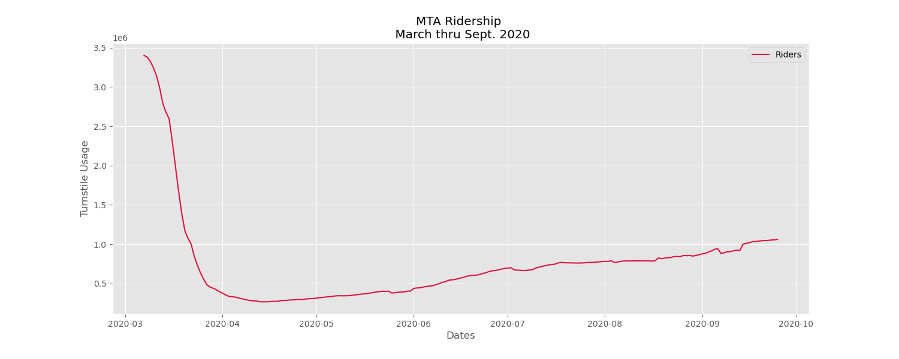
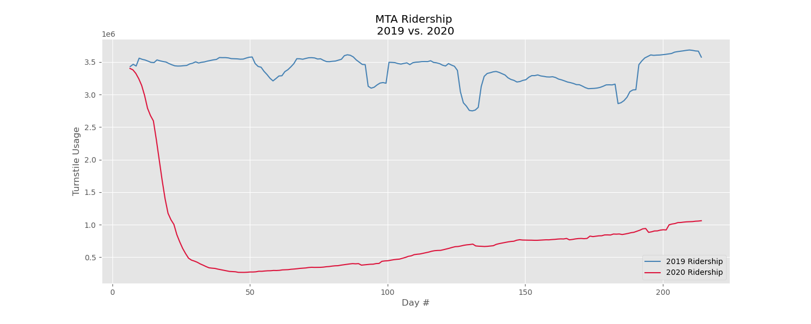
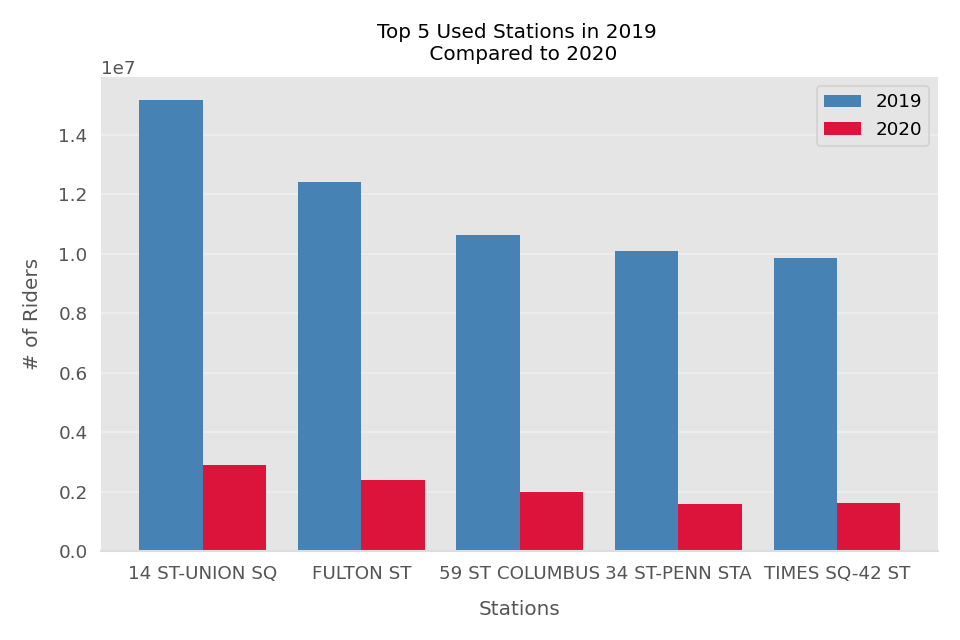
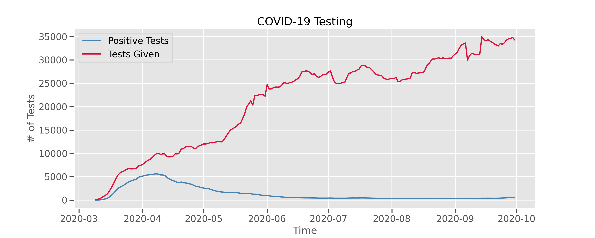
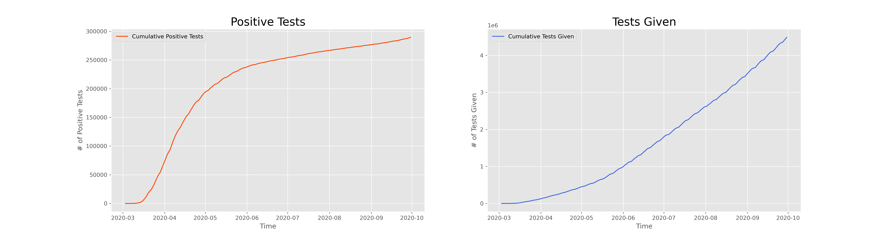

# MTA-Ridership-Impact-of-COVID-19
## How COVID-19 Effected MTA Usage in NYC

  I am a New Yorker, living in Queens, who takes the MTA daily; well, I used to until the quarentines started. One thing I noticed the times I did take the subway was that it is alot less crowded than it usually is. That had me thinking, was it just me or was this the actual case. That is what lead me to do this project and find out if it was all in my head or this was a reality. In this analysis, I perform some Exploritory Data Analysis (EDA) on turnstile data from 2019 and 2020, as well COVID-19 data for the city of New York. I perform a few Hypothesis Tests to see if there was a difference in turnstile usage and how coronavirus cases and tests given correlate with median household income levels. My goal is to find out if COVID-19 had an effect on MTA usage and to find out what nieghborhoods did it effect more.
  
# About the Data
I retreaved the datasets from the following places:
* Turnstile Datasets
  * 2019: https://data.ny.gov/Transportation/Turnstile-Usage-Data-2019/xfn5-qji9
  * 2020: https://data.ny.gov/Transportation/Turnstile-Usage-Data-2020/py8k-a8wg
* COVID-19 Datasets
  * https://github.com/nychealth/coronavirus-data 
  * https://www1.nyc.gov/site/doh/covid/covid-19-data.page
  * https://data.cityofnewyork.us/browse?category=Health&q=covid
* Median Income Dataset:
  * https://pypi.org/project/uszipcode/ 

# Background Information

Coronavirus disease (COVID-19) is an infectious disease caused by a newly discovered coronavirus. Most people infected with the COVID-19 virus will experience mild to moderate respiratory illness and recover without requiring special treatment.
* The first laboratory-confirmed case of COVID-19 in the United States was confirmed on January 20, 2020, and reported to CDC on January 22, 2020.
* As of September 30, 2020, there has been 8.93M COVID-19 cases and 228K COVID-19 deaths across the United States.
* The NYC MTA subway service has been and still is suspended from 1 a.m. to 5 a.m. for disinfection of stations and trains.
* It is and has been a requirement by law to wear a mask while on MTA subways.

# Economic Impact of COVID-19 for New Yorkers
***NYC***: Coronavirus likely to cost NYC over $10 billion in lost revenue.

***MTA***: The New York MTA projects total coronavirus losses between $7 - $8.5 billion. There are talks about a possible 40% cut in MTA services.

***Individual***: NYC unemployment rate is 16%, twice as high as the rest of the country.

# Exploratory Data Analysis
## Turnstile Datasets
Before I could run any hypothesis tests to try and help answer the questions I had, I first had to clean and make sense of the turnstile data from the MTA. The first thing I wanted to know before proceeding any further was, is there a difference in turnstile usage between 2019 and 2020. Since the data for the coronavirus didn't start until March 1, 2020. I decided to compare the timeframes of March 1st thru September 30th, for both 2019 and 2020. After cleaning the turnstile data for daily usuage across the city, I found the following results:

I wanted to see what the drops in 2019 were from, so after further analysis, I discovered those were all during holiday weekends (i.e. Easter, Memorial Day, 4th of July, and Labor Day). 

As you can see, during the month of March there was a significant drop in turnstile usage. It then started to rise again but nothing compared to the turnstile usage from 2019 for the same times.

Next I broke up the turnstile usage datasets by station and compared the top 5 used stations in 2019 with those same stations in 2020 and found the following: 

It was pretty obvious at this point that there was indeed a significant drop of turnstile usage in 2020. But just to be sure, I ran my first hypothesis test. My Null Hypothesis was that there was NO difference in MTA turnstile usage between March 1st thru September 30th for 2019 and 2020; I ran my experiment with a significance level of 0.05. My conclusion was that there is sufficient statistical evidence that there was a difference in MTA Turnstile usage during those times, with a p-value very close to zero.

## COVID-19 Datasets
In my coronavirus datasets I had the following features:
* Totals Datasets
    * Positive case counts by zip code
    * Positive case counts by borough
    * Hospitalizations by borough
    * Deaths by borough
* Testing Datasets
    * Tests given by day
    * Positive results by day
    * Tests given by zip code
    * Positive results by zip code
    
First thing I did was look at the citywide numbers. I found that between March 1, 2020 and September 30, 2020, there were 252,281 cases, 58,695 hospitalizations, and 19,314 deaths from the coronavirus.

After that, I analized the datasets by borough. That is where I found the following results:

This all made sense, considering Queens, Brooklyn, and the Bronx have the highest population in NYC. I wanted to find out if the hospitalizations and deaths followed suit with the case count and found that they did as shown below.

After breaking the datasets down by borough, I then proceeded to break them down by zip codes to try and isolate the coronavirus hotspots.

I found that the neighborhood with the highest case count of the coronavirus was Corona, Queens, with a case count of 5,313. The least case count was the Financial District in Manhatten, with a case count of 52.

I then wanted to compare this information with the median household income levels of each zip code and found the following:

After looking at both graphs, it seemed to me that the zip codes with the higher median household incomes tended to have less coronavirus cases. I then adjusted for population and found the following results:

Seeing this somewhat confirmed my theory but I had to be sure. So I then conducted my second hypothesis test.

My Null Hypothesis was that there is no difference in the covid-19 case count ratio and median household incomes, with a significance level of 0.05. My conclusion was that there was sufficient statistical evidence to say there is a difference in the COVID-19 case count ratio and median household incomes, with a p-value close to 0. 

My next step was to look at the testing datasets. First by comparing tests given by day with positive results by day.

As you can see, during the beginning of the pandemic, the amount of tests given and the amount of positive results were following a similar slope. However, about the first of second week of April, the positive tests started to decline. That led me to wonder why. After some investigation I have come to the conclusion that it was because during the time where they followed a similar slope, coronavirus tests were only given to people who they really though might of had it because of test availability. But as tests became more available and people started to quarentine and social distance, tests given continues to rise on a daily basis and positive results started to decline.

I then wondered, how many tests were given and how many of them came back positive?

I found that from the timeframe of March 1, 2020 and September 30, 2020, there were 4,487,431 tests given in NYC and 289,475 of them came back positive for COVID-19. The trend of tests given and positive results is shown below.

As I did with the case counts above, I then proceeded to break up these datasets by zip codes. I found the following:

I then looked at the tests given and compared it with the median household incomes and saw that it seemed that less tests were given to the more wealthier neighborhoods. Just like before I then adjusted for population and found the following results.

This showed something different; showing that there was indeed more tests given to weathier neighborhoods but the medians seemed very close. This was when I wanted to verify and decided to run my third hypothesis test.

My Null Hypothesis was that there is no difference in the testing rate given and median household incomes, I ran my experiment with a significance level of 0.05. My conclusion was that there is sifficient statistical evidence to say there is a difference in the testing rate given and median household incomes, with a p-value close to 0.

# Conclusion
* There was indeed a difference in MTA usage between 2019 and 2020. In 2020, turnstile usage dropped significantly.
* Covid-19 was a main contributor to this.
* Lower Median Household Income levels do coincide with less tests available and more COVID-19 cases.

# Next Steps
* Collect more data after this winter to see if trends stay the same.
* Look into other causes why people may have stopped taking the subways (i.e. MTA policies, Safety due to new laws, etc.).

